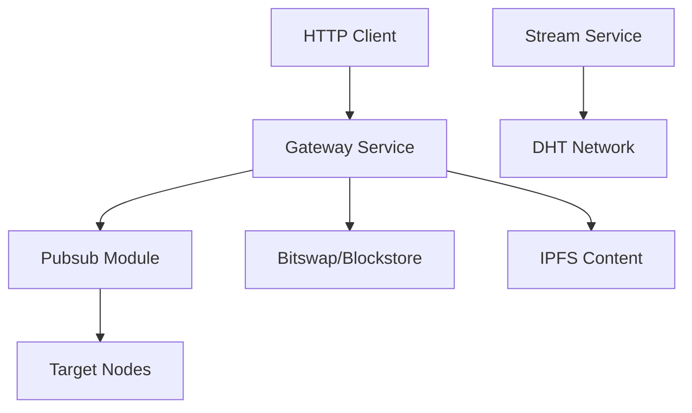

# IPFS Gateway

A modular IPFS gateway implementation in Go that provides HTTP gateway proxy, P2P communication, file transfer, and service discovery capabilities.

## 🚀 Features

- **HTTP Gateway Proxy**: Access IPFS content via HTTP endpoints (`/ipfs/*`, `/ipns/*`)
- **File Operations**: Upload, download, and publish files with REST API
- **Pubsub File Distribution**: Targeted file publishing with gob serialization
- **P2P Ping-Pong Service**: Node health checks and network diagnostics
- **DHT Service Discovery**: Distributed service registration and peer discovery
- **Bitswap Integration**: Efficient block-level file transfer protocol

## 📁 Project Structure

```
ipfs-gateway/
├── main.go                 # Application entry point
├── gateway/               
│   └── gateway.go         # HTTP gateway and API handlers
├── pubsub/
│   ├── pubsub.go          # File publishing and subscription
│   └── pubsub_test.go     # Tests for pubsub functionality
├── stream/
│   ├── ping.go            # Ping functionality
│   └── pong.go            # Pong service with DHT broadcasting
├── service/
│   ├── provide.go         # DHT service advertising
│   └── search.go          # Peer discovery
├── go.mod                 # Go module dependencies
└── go.sum                 # Dependency checksums
```

## 🛠 Technology Stack

- **Go**: 1.24.0+
- **IPFS**: github.com/ipfs/boxo v0.34.0
- **libp2p**: github.com/libp2p/go-libp2p v0.43.0
- **Web Framework**: github.com/labstack/echo/v4 v4.13.4
- **DHT**: github.com/libp2p/go-libp2p-kad-dht v0.34.0

## 📦 Installation

### Prerequisites

- Go 1.24.0 or higher
- Git

### Setup

```bash
# Clone the repository
git clone <repository-url>
cd ipfs-gateway

# Download dependencies
go mod tidy

# Build the application
go build -o ipfs-gateway .
```

## 🎯 Usage

### Starting the Gateway

```bash
# Start with default configuration
./ipfs-gateway

# The gateway will start on port 8080
# HTTP Gateway: http://localhost:8080
# API Endpoints: http://localhost:8080/api/v1/
```

### API Endpoints

#### File Operations

**Upload File**
```bash
curl -X POST \
  http://localhost:8080/api/v1/files/upload \
  -F "file=@example.txt"
```

**Download File**
```bash
curl -X POST \
  http://localhost:8080/api/v1/files/download \
  -H "Content-Type: application/json" \
  -d '{
    "cid": "QmExample123",
    "filename": "downloaded.txt"
  }'
```

**Publish File via Pubsub**
```bash
curl -X POST \
  http://localhost:8080/api/v1/files/publish \
  -H "Content-Type: application/json" \
  -d '{
    "file_path": "./example.txt",
    "topic": "file-sharing",
    "target_node": "12D3KooWTargetPeerID"
  }'
```

#### Transfer Operations

**Direct Transfer Download**
```bash
curl -X POST \
  http://localhost:8080/api/v1/transfer/download/QmExample123?filename=file.txt
```

**Direct Transfer Upload**
```bash
curl -X POST \
  http://localhost:8080/api/v1/transfer/upload \
  -F "file=@example.txt"
```

### IPFS Content Access

Access IPFS content directly through the HTTP gateway:

```bash
# Access IPFS content
curl http://localhost:8080/ipfs/QmExample123

# Access IPNS content  
curl http://localhost:8080/ipns/example.eth
```

## 🏗 Architecture

### Core Components

1. **Gateway Service** (`gateway/gateway.go`)
   - HTTP server with Echo framework
   - REST API endpoints for file operations
   - IPFS content proxy
   - Shared IPFS components (datastore, blockstore, bitswap)

2. **Pubsub Module** (`pubsub/pubsub.go`)
   - File message broadcasting
   - Gob serialization for efficient messaging
   - Target node filtering
   - Automatic file writing for matched nodes

3. **Stream Communication** (`stream/`)
   - Ping-pong protocol implementation
   - DHT service broadcasting
   - Network health monitoring

4. **Service Discovery** (`service/`)
   - DHT-based peer discovery
   - Service advertising and registration
   - Automatic peer connection management

### Data Flow



## 🔧 Configuration

The application uses sensible defaults but can be customized:

- **Port**: Default 8080 for HTTP gateway
- **Download Directory**: `./downloads` for received files
- **DHT Bootstrap**: Connects to standard libp2p bootstrap nodes
- **Timeouts**: 30 seconds for file operations

## 🧪 Testing

Run the available tests:

```bash
# Run pubsub tests (fully functional)
go test -v ./pubsub

# Run all tests
go test -v ./...
```

### Test Coverage

- ✅ **Pubsub Module**: Complete test suite with gob serialization tests
- ✅ **File Message Validation**: Input validation and error handling
- ✅ **Performance Tests**: Benchmarks for encoding/decoding operations

## 📡 P2P Network Features

### Service Discovery

The gateway automatically:
- Registers services in the DHT network
- Discovers peer nodes
- Maintains connection health
- Broadcasts service availability

### File Distribution

Files can be distributed to specific nodes:
- **Targeted Publishing**: Send files to specific peer IDs
- **Automatic Filtering**: Nodes only receive files intended for them
- **Efficient Serialization**: Uses gob encoding for better performance
- **Network Resilience**: Built on libp2p for robust P2P communication

## 🔍 Troubleshooting

### Common Issues

1. **Port Already in Use**
   ```bash
   # Check if port 8080 is available
   lsof -i :8080
   ```

2. **DHT Bootstrap Failures**
   - Network connectivity issues
   - Firewall blocking P2P connections
   - Bootstrap nodes unreachable

3. **File Download Failures**
   - Invalid CID format
   - Content not available in network
   - Insufficient peers

### Debug Mode

Enable verbose logging by checking the application logs for detailed error messages.

## 🤝 Contributing

1. Fork the repository
2. Create a feature branch
3. Make your changes
4. Add tests for new functionality
5. Submit a pull request

## 📄 License

This project is licensed under the MIT License - see the LICENSE file for details.

## 🙏 Acknowledgments

- [IPFS](https://ipfs.io/) for the distributed web protocol
- [libp2p](https://libp2p.io/) for P2P networking primitives
- [Echo](https://echo.labstack.com/) for the HTTP web framework
- Go community for excellent tooling and libraries

## 📞 Support

For issues and questions:
- Check the troubleshooting section
- Review existing issues in the repository
- Create a new issue with detailed error information

---

Built with ❤️ using Go and IPFS technologies.